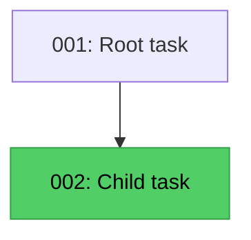
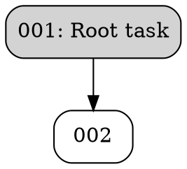

# taskmd Operations Specification

**Version:** 1.0
**Last Updated:** 2026-02-28

This document defines the behavioral contracts for core taskmd operations. It complements the [taskmd Specification](./taskmd_specification.md), which defines file format and schema. This document defines what operations **do** — their inputs, outputs, algorithms, and edge cases.

Any conformant taskmd library implementation must produce results consistent with this specification.

---

## Table of Contents

1. [Scanning](#1-scanning)
2. [Filtering](#2-filtering)
3. [Validation](#3-validation)
4. [Next-Task Ranking](#4-next-task-ranking)
5. [Dependency Resolution](#5-dependency-resolution)
6. [Graph Construction](#6-graph-construction)
7. [Search](#7-search)

---

## 1. Scanning

Scanning discovers task files from a directory tree and parses them into task objects.

### 1.1 File Discovery

- Traverse the root directory recursively using lexicographic (alphabetical) order.
- Only files with the `.md` extension are candidates (case-insensitive check).
- All other files are silently skipped.
- Files that fail to parse as valid tasks are silently skipped (may be logged in verbose mode).

### 1.2 Directory Skip Rules

The following directories are **always skipped** during traversal:

1. **Dotfile directories** — any directory whose name starts with `.` (e.g., `.git`, `.github`, `.vscode`).
2. **Default skip directories** — the following names (exact, case-sensitive match):
   - `node_modules`
   - `vendor`
   - `dist`
   - `build`
   - `.next`
   - `.nuxt`
   - `out`
   - `target`
   - `__pycache__`
   - `archive`

3. **User-configured ignore directories** — additional directory names from the `ignore` key in `.taskmd.yaml`. These are merged with the defaults.

When a directory is skipped, its entire subtree is excluded from traversal.

### 1.3 Task File Recognition

A file is recognized as a valid task if **both** conditions are met after parsing:

- `id` is non-empty
- `title` is non-empty

These fields may come from YAML frontmatter or be derived from the filename (see §1.5).

### 1.4 Frontmatter Extraction

- If the first line (trimmed) of the file is `---`, the parser looks for a closing `---` line.
- Lines between the two delimiters are parsed as YAML.
- Everything after the closing delimiter is the task body (`strings.TrimSpace` applied).
- If no opening `---` is found, the entire file content is treated as body (no frontmatter).
- An unclosed `---` delimiter (opening without closing) is a parse error.

### 1.5 ID Derivation from Filename

When `id` or `title` is empty after frontmatter parsing, the scanner attempts to derive missing fields from the filename (without extension). Only missing fields are populated — existing frontmatter values are preserved.

The filename (minus `.md`) is matched against these patterns **in priority order**:

| Priority | Pattern | ID | Slug | Example |
|----------|---------|-----|------|---------|
| 0 (highest) | Full UUID (`8-4-4-4-12` lowercase hex) | The UUID | Remainder after UUID and separator | `f47ac10b-58cc-4372-a567-0e02b2c3d479-my-task.md` |
| 1 | Sequential (starts with digit `[0-9]`) | First segment before `-` | Remainder | `009-add-feature.md` → id=`009` |
| 2 | Prefixed (`[a-z]+-[0-9]+`) | Alpha prefix + `-` + digits | Remainder | `dr-001-fix-login.md` → id=`dr-001` |
| 3 | Random (3–8 chars `[a-z0-9]`, at least one digit) | First segment | Remainder | `a3f9x2-slug.md` → id=`a3f9x2` |
| 4 | Hex ID (9–32 lowercase hex chars) | First segment | Remainder | `deadbeef123-slug.md` → id=`deadbeef123` |

If no pattern matches, no fields are derived and the file is not a valid task (unless frontmatter provides both `id` and `title`).

**Title derivation**: The slug portion has hyphens replaced with spaces. E.g., slug `add-feature` becomes title `add feature`.

### 1.6 Group Inference

The `group` field is determined as follows:

1. If `group` is set in frontmatter, use that value as-is.
2. Otherwise, derive from the file's directory path relative to the scan root:
   - If the file is directly in the root directory, group is `""` (empty).
   - Otherwise, group is the **last segment** of the relative directory path.
   - Example: `root/foo/bar/task.md` → group `bar` (not `foo/bar`).

### 1.7 Archive Scanning

Archive scanning is a **separate operation** from normal scanning:

- Normal scanning skips directories named `archive` (it is in the default skip list).
- Archive scanning specifically targets `archive/` directories under the root.
- It walks into `archive` directories, applying the same dotfile and ignore-dir rules (except `archive` itself is allowed through).
- Parsed tasks from archives are returned separately — they are not part of the main scan result.
- Archive tasks are used for dependency and parent resolution (see §5) and validation (see §3).

### 1.8 Scan Result

A scan produces:
- **Tasks**: a list of parsed task objects.
- **Errors**: a list of `(filePath, error)` pairs for files that encountered access errors (e.g., permission denied). Access errors do not abort the scan.

---

## 2. Filtering

Filtering reduces a task list based on field-value criteria.

### 2.1 Expression Format

Each filter expression is a string in the form `field=value`:

- Split on the **first** `=` character.
- Leading and trailing whitespace on both field and value are trimmed.
- An expression missing `=` is an error.

### 2.2 Combination

Multiple filter expressions combine with **AND** logic: a task must match every expression to be included in the result.

### 2.3 Field Matching Rules

| Field | Match Type | Details |
|-------|-----------|---------|
| `status` | Exact | `task.Status == value` |
| `priority` | Exact | `task.Priority == value` |
| `effort` | Exact | `task.Effort == value` |
| `type` | Exact | `task.Type == value` |
| `id` | Exact | `task.ID == value` |
| `group` | Exact | `task.Group == value` |
| `owner` | Exact | `task.Owner == value` |
| `title` | Substring | Case-insensitive `contains` check |
| `tag` | Collection | Value must appear in `task.Tags` (exact, case-sensitive) |
| `touches` | Collection | Value must appear in `task.Touches` (exact, case-sensitive) |
| `blocked` | Boolean | `blocked=true` matches tasks with `len(Dependencies) > 0`; `blocked=false` matches tasks with no dependencies |
| `parent` | Bool/value | `parent=true` matches tasks with a parent set; `parent=false` matches tasks without; any other value is an exact match against `task.Parent` |

### 2.4 Unknown Fields

A filter on an unrecognized field name always returns `false` (no tasks match). No error is raised.

### 2.5 Limitations

- No negation operators (no `!=`, `!`, `not`).
- No OR logic — all filters are AND.
- No regex or glob patterns.
- No range queries (no `>=`, `<=`).

---

## 3. Validation

Validation checks a set of tasks for structural and semantic correctness.

### 3.1 Check Order

Checks run in this fixed order. All checks run regardless of earlier failures (errors accumulate):

| # | Check | Level |
|---|-------|-------|
| 1 | Required fields (`id`, `title`) | Error |
| 2 | Invalid enum values | Error (status, priority, effort) / Warning (type) |
| 3 | Duplicate IDs | Error |
| 4 | Missing dependencies | Error |
| 5 | Circular dependencies | Error |
| 6 | Missing parent | Error |
| 7 | Parent self-reference | Warning |
| 8 | Parent cycles | Error |
| 9 | Strict-mode warnings (if enabled) | Warning |

### 3.2 Required Fields

- `id` must be non-empty.
- `title` must be non-empty.

Missing required fields produce an error per task.

### 3.3 Valid Enum Values

**Status** (invalid → error):
`pending`, `in-progress`, `completed`, `in-review`, `blocked`, `cancelled`, `""` (empty)

**Priority** (invalid → error):
`low`, `medium`, `high`, `critical`, `""` (empty)

**Effort** (invalid → error):
`small`, `medium`, `large`, `""` (empty)

**Type** (invalid → warning, not error):
`feature`, `bug`, `improvement`, `chore`, `docs`, `""` (empty)

Empty values are always valid — they represent "not set."

### 3.4 Duplicate IDs

If two or more tasks share the same `id`, an error is emitted listing the count and file paths involved.

### 3.5 Missing Dependencies

For each task's `dependencies` list: if a referenced ID does not exist in the scanned task set **and** is not in the set of external (archived) task IDs, an error is emitted.

### 3.6 Circular Dependencies

Detected via depth-first search with three-color marking (unvisited, visiting, visited):
- A cycle is found when DFS encounters a node currently in the "visiting" state.
- The cycle path is reported as a chain of IDs: `A -> B -> C -> A`.
- Missing dependency targets are skipped (not traversed into).

### 3.7 Missing Parent

If `task.Parent` references an ID not in the task set and not in external IDs, an error is emitted.

### 3.8 Parent Self-Reference

If `task.Parent == task.ID`, a **warning** (not error) is emitted.

### 3.9 Parent Cycles

For each task with a parent, the validator walks the parent chain. If the chain revisits a previously seen ID, an error is emitted.

### 3.10 Strict Mode

When strict mode is enabled, additional **warnings** are emitted for tasks missing:
- `status` — "task has no status specified (will default to pending)"
- `priority` — "task has no priority specified (will default to medium)"
- `effort` — "task has no effort specified (will default to medium)"
- `group` — "task has no group specified"
- `tags` — "task has no tags"
- Body content — "task has no description/body content"

### 3.11 External (Archived) IDs

Archived task IDs can be registered before validation. These IDs satisfy missing-dependency and missing-parent checks (the archived tasks themselves are not validated).

### 3.12 Config Validation

Separate from task validation, the config file (`.taskmd.yaml`) can be validated:

1. **Scopes** — each scope must have a non-empty `paths` field.
2. **Unknown keys** — top-level keys not in the known set produce a warning. Known keys: `dir`, `task-dir`, `web`, `scopes`, `sync`, `ignore`, `workflow`, `todos`, `id`.
3. **Workflow** — must be `solo` or `pr-review` (if set).
4. **ID config** — `strategy` must be one of `sequential`, `prefixed`, `random`, `ulid`. If strategy is `prefixed`, `prefix` must be non-empty. `length` and `padding` must be non-negative.

### 3.13 Touches Validation

When scopes are defined in config, each task's `touches` entries are checked against the known scope names. Unknown scope names produce a warning (each undefined name reported once).

### 3.14 Exit Codes

| Code | Meaning |
|------|---------|
| 0 | Valid — no errors (warnings OK in non-strict mode) |
| 1 | Errors found |
| 2 | Strict mode only — no errors but warnings present |

### 3.15 Duplicate ID Behavior in Commands

All commands that scan tasks check for duplicate IDs after scanning. If duplicates exist, a warning is printed to stderr listing the affected IDs and file paths.

All commands that target a specific task by ID (`get`, `status`, `set`, `rm`) will **refuse to proceed** if that ID has duplicates, exiting with a non-zero status code and an error message listing each conflicting task's file path and title. The user must resolve duplicates (via `taskmd deduplicate` or manual edit) before the command will run.

---

## 4. Next-Task Ranking

The next-task algorithm identifies the most impactful actionable tasks.

### 4.1 Actionability

A task is **actionable** if all three conditions are met:

1. **Status**: `pending` or `in-progress`.
2. **Dependencies met**: every task in `dependencies` exists in the task map AND has status `completed`. (See §5 for full dependency resolution rules.)
3. **Children resolved**: no child tasks (tasks with `parent` pointing to this task) have an unresolved status. A child is resolved if its status is `completed` or `cancelled`.

### 4.2 Scoring Formula

Each actionable task receives a numeric score:

```
score = priorityScore
      + criticalPathBonus
      + downstreamBonus
      + effortBonus
```

**Priority score:**

| Priority | Score |
|----------|-------|
| `critical` | 40 |
| `high` | 30 |
| `medium` | 20 |
| `low` or empty | 10 |

**Downstream priority multiplier** — based on the highest priority among a task's transitive downstream dependents:

| Max downstream priority | Multiplier |
|------------------------|------------|
| `critical` or `high` | 1.0 |
| `medium` | 0.5 |
| `low` or empty | 0.25 |

**Critical path bonus**: `floor(15 × multiplier)`, added only if the task is on the critical path.

**Downstream bonus**: `floor(min(count × 3, 15) × multiplier)`, where `count` is the number of transitively downstream tasks.

**Effort bonus:**

| Effort | Bonus |
|--------|-------|
| `small` | 5 |
| `medium` | 2 |
| `large` or empty | 0 |

### 4.3 Critical Path

The critical path identifies tasks at the maximum dependency chain depth:

1. Compute depth for each task via memoized DFS: `depth = 1 + max(depth of pending/in-progress dependencies)`. Resolved tasks (completed or cancelled) have depth 0.
2. Find the maximum depth across all tasks.
3. Tasks with depth equal to the maximum are on the critical path.
4. Dependencies along the chain are included if their depth is exactly one less than the task depending on them.

### 4.4 Sort Order

Tasks are sorted by:
1. **Score descending** (highest first).
2. **ID ascending** (lexicographic) as tie-breaker.

The sort is stable.

### 4.5 Limit

Default result limit is **5** tasks when no explicit limit is specified.

### 4.6 Special Filters

Applied after actionability filtering, before scoring:

- **Quick wins** (`--quick-wins`): keep only tasks with `effort = small`.
- **Critical** (`--critical`): keep only tasks on the critical path.
- Both filters can be combined (AND logic).

### 4.7 Reason Strings

Each scored task includes human-readable reason strings:

- `"critical priority"` — priority is critical
- `"high priority"` — priority is high
- `"on critical path"` — task is on the critical path
- `"unblocks N task"` / `"unblocks N tasks"` — downstream count > 0
- `"quick win"` — effort is small

Medium/low priority, large/empty effort, and zero downstream produce no reason strings.

---

## 5. Dependency Resolution

### 5.1 Dependency "Met" Definition

A dependency is **met** if and only if the referenced task has status `completed`.

- `cancelled` does **not** satisfy a dependency.
- Missing dependencies (ID not in task map) are treated as **unmet**.

### 5.2 Child Resolution

A child task is **resolved** if its status is `completed` or `cancelled`.

- `cancelled` **does** satisfy the child-completion check (unlike dependencies).
- This is used in the actionability check for parent tasks (see §4.1).

### 5.3 Met vs. Resolved — Summary

| Concept | Satisfied by `completed` | Satisfied by `cancelled` | Missing ID |
|---------|-------------------------|-------------------------|------------|
| Dependency "met" | Yes | **No** | Unmet |
| Child "resolved" | Yes | Yes | N/A |

### 5.4 Archived Tasks

Archived tasks are merged into the task map for dependency resolution. Active tasks take precedence if the same ID exists in both sets. An archived task's status is checked normally — if archived and `completed`, the dependency is met; if archived and `pending`, it is unmet.

### 5.5 No Transitive Collapse

Each task's dependencies are checked independently. There is no transitive reduction or collapse — if task A depends on B and C, and B depends on C, both B and C must be completed for A to be actionable.

---

## 6. Graph Construction

### 6.1 Adjacency

Two adjacency maps are built from `task.Dependencies`:

- **Forward** (`Adjacency`): `depID → [taskIDs that depend on depID]` — answers "what does this task unblock?"
- **Reverse** (`RevAdjacency`): `taskID → [depIDs]` — answers "what does this task depend on?"

### 6.2 Cycle Detection

DFS with two sets: `visited` (permanently done) and `recStack` (currently in recursion). Traverses via reverse adjacency. When a node in `recStack` is re-encountered, the cycle path is extracted and returned. Each cycle is reported once.

### 6.3 Subgraph Extraction

- **Downstream** (`GetDownstream`): BFS/DFS via forward adjacency from a given task. Returns all transitively dependent task IDs (excluding the root).
- **Upstream** (`GetUpstream`): BFS/DFS via reverse adjacency. Returns all transitive dependency IDs (excluding the root).

### 6.4 Filtering

`FilterTasks(taskIDs)` produces a subgraph containing only the specified tasks. Adjacency is rebuilt from scratch for the filtered set.

### 6.5 Default Behavior

Completed tasks are excluded by default. This can be overridden.

### 6.6 Output Formats

#### 6.6.1 ASCII

Renders a tree-like structure:

```
[001] Root task
├── [002] Child task ✓
├── [003] Blocked task ⊗
│   └── [005] Grandchild ⋯
└── [004] Another child
    └── [003] Blocked task (see above)
```

**Root selection** (when no root task is specified):
- Downstream mode: tasks with no dependencies.
- Upstream mode: tasks with no dependents.
- If no roots found (pure cycle): all tasks used as roots, sorted by ID.
- Multiple roots separated by a blank line.

**Status indicators** (appended after title):
| Status | Indicator |
|--------|-----------|
| `completed` | ` ✓` |
| `in-progress` | ` ⋯` |
| `blocked` | ` ⊗` |
| Other statuses | none |

**Already-visited nodes**: Printed as `[ID] Title (see above)` — children are not recursively expanded.

**Connectors**: `├── ` for non-last children, `└── ` for last child.
**Indentation**: `│   ` under non-last children, `    ` (4 spaces) under last children.
**Child ordering**: Alphabetical by ID.

#### 6.6.2 Mermaid



Class tags: `:::focus` (for focused task), `:::completed`, `:::inprogress`, `:::blocked`.
Titles have `"` escaped as `&quot;`.
Edges: `depID --> taskID`.

#### 6.6.3 DOT



Fill colors: focus=`red`, completed=`lightgreen`, in-progress=`yellow`, blocked=`gray`, default=`lightgray`.
Titles have `"` escaped as `\"`.

#### 6.6.4 JSON

```json
{
  "nodes": [
    {"id": "001", "title": "Root task", "status": "pending", "priority": "high", "group": "cli"}
  ],
  "edges": [
    {"from": "001", "to": "002"}
  ],
  "cycles": [["A", "B", "C", "A"]]
}
```

- `nodes`: sorted by ID. Fields: `id`, `title`, `status`. `priority` and `group` included only if non-empty.
- `edges`: `from` is the dependency, `to` is the dependent task. Deduplicated.
- `cycles`: only present when cycles exist.

---

## 7. Search

### 7.1 Fields Searched

Only two fields are searched:
- `task.Title`
- `task.Body`

Other fields (tags, ID, etc.) are not included in search.

### 7.2 Matching

Case-insensitive substring matching. Both the query and the field values are lowercased before comparison.

A task matches if the query is found in either the title or the body (or both).

### 7.3 Match Location

The result reports where the match was found:
- `"title"` — matched in title only
- `"body"` — matched in body only
- `"title,body"` — matched in both

### 7.4 Snippet Generation

For body matches, a snippet is extracted around the first occurrence:

1. Find the index of the first match in the lowercased body.
2. Compute a window: `start = max(index - 40, 0)`, `end = min(index + len(query) + 40, len(body))`.
3. Trim to word boundaries:
   - If `start > 0`: advance to the first space after `start`, then past the space.
   - If `end < len(body)`: retreat to the last space before `end`.
4. Collapse internal whitespace (multiple spaces/newlines become single spaces).
5. Prepend `...` if `start > 0`; append `...` if `end < len(body)`.

The context radius is **40 characters** on each side of the match.

For title-only matches, the snippet is the raw task title.

### 7.5 Filtering and Limits

Filters (§2) are applied **before** search. The search limit is applied **after** matching.

---

## Appendix A: Configuration Reference

### A.1 Config File

File name: `.taskmd.yaml`

Search order (highest precedence first):
1. `--config <path>` flag
2. Current working directory
3. Home directory (`$HOME`)

Environment variable prefix: `TASKMD_` (dots and hyphens replaced with underscores).

### A.2 Known Config Keys

| Key | Type | Description |
|-----|------|-------------|
| `task-dir` | string | Root directory for task files |
| `dir` | string | Deprecated alias for `task-dir` |
| `web` | object | Web UI configuration |
| `scopes` | object | Named scope definitions |
| `sync` | object | Sync configuration |
| `ignore` | string[] | Additional directory names to skip during scanning |
| `workflow` | string | `solo` (default) or `pr-review` |
| `todos` | object | Todo extraction configuration |
| `id` | object | ID generation strategy |

### A.3 ID Generation

| Strategy | Behavior |
|----------|----------|
| `sequential` | Finds max numeric suffix among existing IDs, returns `max+1` zero-padded (default padding: 3) |
| `prefixed` | Like sequential but scoped to a specific prefix (case-insensitive). Requires `prefix` to be set. |
| `random` | Cryptographic random, base-36 lowercase (`[0-9a-z]`), configurable `length` (default: 6). Up to 100 collision retries. |
| `ulid` | ULID (timestamp + random), Crockford Base32 lowercase, 26 chars (truncatable via `length`). Up to 100 collision retries. |

Default ID config:
```yaml
id:
  strategy: sequential
  length: 6
  padding: 3
```

---

## Appendix B: Conformance Testing

A conformance test suite is provided in `tests/conformance/`. See `tests/conformance/README.md` for usage instructions.

Each operation has:
- **Fixture files** in `tests/conformance/fixtures/` — shared task files and configs.
- **Expected outputs** in `tests/conformance/expected/` — canonical JSON results for each operation.

Implementations should load the fixtures, run the operation, and compare the result against the expected output.
